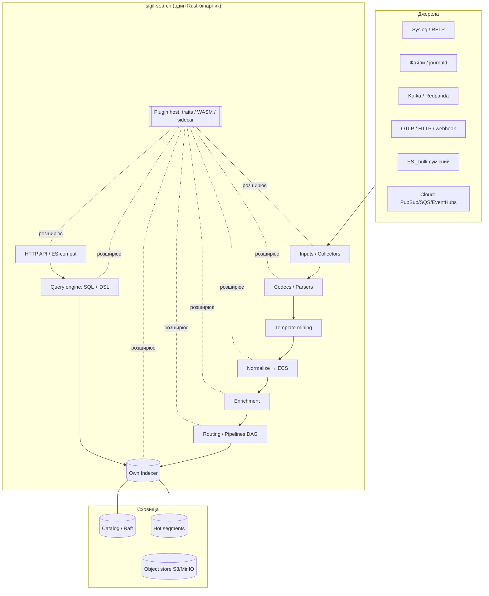
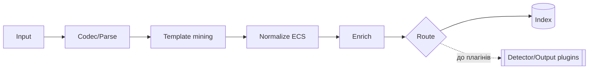
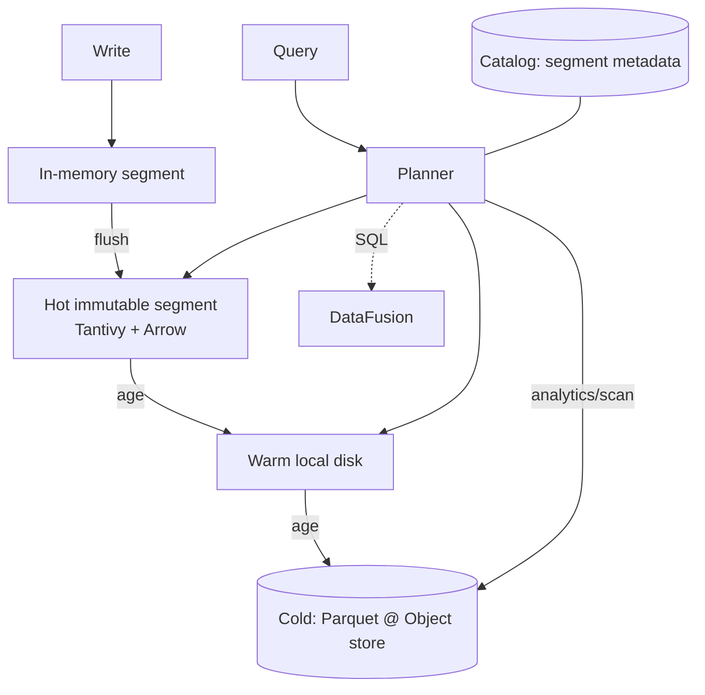
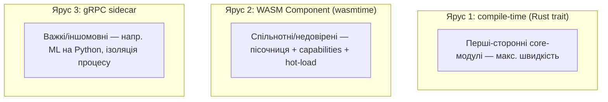
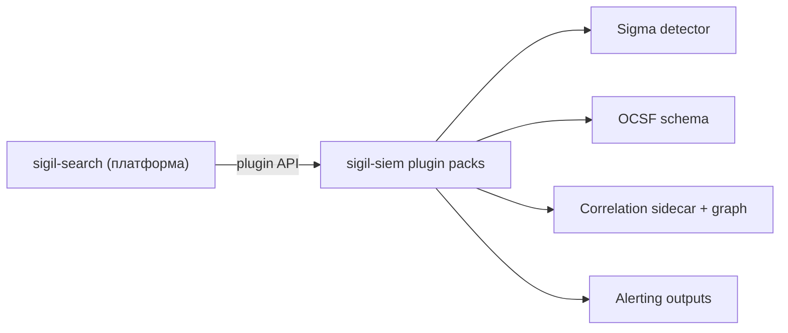

# Sigil Search — дизайн-документ платформи (ELK-аналог на Rust)

> **Статус:** чернетка v0.1 для обговорення · **Тип:** open-source / портфоліо
> **Мова ядра:** Rust (моноліт) · **Бінарник:** `sigil-search`
> **Відношення до Sigil SIEM:** `sigil-search` — це **платформа** (пошук,
> прийом, нормалізація, аналітика). `sigil-siem` — окремий **дистрибутив**,
> що сідає на цю платформу набором плагінів (Sigma, кореляція, ATT&CK).

Це опис **кінцевого вигляду платформи**: аналог ELK (Elasticsearch + Logstash +
Kibana) на Rust — єдиний бінарник з власним індексером, нормалізацією,
вертикальним і горизонтальним масштабуванням, declarative-first конфігурацією
та системою плагінів, **достатньо потужною, щоб надбудовою перетворити платформу
на enterprise SIEM**.

---

## Зміст

1. [Бачення, цілі, межі](#1-бачення-цілі-межі)
2. [Як це співвідноситься з ELK](#2-як-це-співвідноситься-з-elk)
3. [Принципи дизайну](#3-принципи-дизайну)
4. [Архітектура верхнього рівня](#4-архітектура-верхнього-рівня)
5. [Модель виконання та масштабування](#5-модель-виконання-та-масштабування)
6. [Конвеєр обробки подій](#6-конвеєр-обробки-подій)
7. [Модель даних та схема (ECS-first, pluggable)](#7-модель-даних-та-схема-ecs-first-pluggable)
8. [Власний індексер та сховище](#8-власний-індексер-та-сховище)
9. [Мова запитів](#9-мова-запитів)
10. [Сумісність з екосистемою](#10-сумісність-з-екосистемою)
11. [⭐ Система плагінів та модулів](#11--система-плагінів-та-модулів)
12. [Declarative-first конфігурація](#12-declarative-first-конфігурація)
13. [Безпека платформи](#13-безпека-платформи)
14. [Спостережуваність](#14-спостережуваність)
15. [⭐ Як збудувати SIEM на платформі](#15--як-збудувати-siem-на-платформі)
16. [Технологічний стек](#16-технологічний-стек)
17. [Структура репозиторію](#17-структура-репозиторію)
18. [Дорожня карта](#18-дорожня-карта)
19. [Ризики та ухвалені рішення](#19-ризики-та-ухвалені-рішення)
20. [Глосарій та посилання](#20-глосарій-та-посилання)

---

## 1. Бачення, цілі, межі

**Одним реченням.** Sigil Search — це single-binary платформа на Rust для
прийому, нормалізації, індексації, пошуку й аналітики подій/логів, яка
масштабується від ноутбука до кластера, конфігурується декларативно та
розширюється плагінами — аж до перетворення на повноцінний SIEM.

**Цілі (must-have):**

- **Моноліт, що масштабується** — один бінарник; вертикально (ядра/RAM) і
  горизонтально (рольові вузли + шардування).
- **Власний індексер** — повнотекстовий + колонковий, з гарячим/теплим/холодним
  рівнями і винесенням на об'єктне сховище.
- **Нормалізація** — приведення різнорідних джерел до спільної схеми
  (за замовчуванням **ECS**), із збереженням сирого запису.
- **Плагіни/модулі** — три рівні розширення (compile-time, WASM, gRPC-сайдкар)
  з декларативними дозволами. Це головний механізм, яким платформа доростає до
  SIEM.
- **Declarative-first** — уся система (входи, конвеєри, індекси, схеми, ролі,
  плагіни) описується наперед у версіонованому конфізі, з можливістю ручної
  доконфігурації, що трекається як *drift*.
- **Запити** — і SQL (аналітика), і pipe-DSL (швидкий інтерактивний пошук).

**Кінцева ціль.** Дописати стільки плагінів, щоб отримати enterprise SIEM
(`sigil-siem`): Sigma-детектування, кореляція, ATT&CK, threat intel — усе як
надбудова над незмінним ядром платформи (див. §15).

**Не-цілі (поки що):**

- Не вбудовуємо security-логіку в ядро — вона живе в плагінах (саме це робить
  платформу загальною, а не SIEM-специфічною).
- Не власний UI на старті (API-first; Kibana-подібний UI — пізніший етап).
- Не повний APM/metrics-стек на старті — фокус на логах/подіях; метрики/треси —
  розширення.

---

## 2. Як це співвідноситься з ELK

| Компонент ELK | Роль | Аналог у Sigil Search |
|---|---|---|
| **Elasticsearch** | розподілений пошук + індекс (Lucene) | `sigil-index` (Tantivy + Arrow/DataFusion) + `sigil-cluster` |
| **Logstash** | прийом і трансформація | `sigil-ingest` + конвеєр-DAG + `sigil-schema` |
| **Beats** | легкі шипери | input-плагіни; ES-сумісний `_bulk`; (опц.) власний агент згодом |
| **Kibana** | запити + візуалізація | `sigil-query` + `sigil-api`; web-UI — пізніше |
| **ECS** | спільна схема | ECS як схема за замовчуванням (pluggable, §7) |

**Чесне позиціонування (prior art).** Найближчі реальні проєкти на Rust —
**Quickwit** (пошук на Tantivy поверх об'єктного сховища, ES-сумісний API,
розподілений) і **OpenObserve** (observability на Rust). Sigil Search свідомо
повторює перевірену архітектурну формулу (Tantivy + об'єктне сховище +
ES-сумісність + рольовий моноліт), а **диференціюється системою плагінів і
declarative-first моделлю**, орієнтованими на нарощування до SIEM. Це не
дослідницька новизна, а інженерний продукт; новизна — у `sigil-siem` поверх
(семантично-причинна кореляція).

---

## 3. Принципи дизайну

1. **Modular monolith, не distributed monolith.** Чіткі модулі з вузькими
   інтерфейсами; зовні — один артефакт. Розподіленість вмикається конфігом.
2. **Ядро загальне, фічі — у плагінах.** Нічого предметно-специфічного
   (security тощо) в ядрі. Розширення — через стабільний plugin API.
3. **Schema-first, але schema-on-read як запасний шлях.** Спільна схема (ECS) —
   контракт; сирий запис зберігається завжди.
4. **Backpressure end-to-end.** Тиск передається назад до входу; спіл на
   диск/чергу за потреби.
5. **Дешевий «нульовий» режим.** `sigil-search run` на одному ноуті без Kafka,
   без Kubernetes, без зовнішньої БД.
6. **Декларативність — джерело істини.** Рантайм узгоджується з конфігом; ручні
   зміни видно як drift.
7. **Стабільний plugin API.** Контракти плагінів версіонуються; зворотна
   сумісність — пріоритет (від неї залежить екосистема, зокрема SIEM).

---

## 4. Архітектура верхнього рівня



Плагіни (PLG) можуть розширювати будь-яку стадію — саме так платформа
нарощується (наприклад, SIEM додає детектор-плагіни й вихідний потік алертів).

---

## 5. Модель виконання та масштабування

### 5.1 Один бінарник, кілька «таргетів»

Модель Grafana Loki/Mimir і Quickwit: той самий бінарник у різних ролях.

| Роль (target) | Відповідає за |
|---|---|
| `ingest` | прийом, парсинг, нормалізація, enrichment |
| `index` | побудова сегментів, запис, пошук |
| `query` | API, fan-out пошуку по index-вузлах |
| `coordinator` | каталог, членство кластера, мапа шардів (Raft) |

```bash
sigil-search run --config ./sigil-search.yaml     # монолітний режим (target=all)
sigil-search run --target ingest,index            # горизонтально: роль на вузол
sigil-search run --target query,coordinator
```

### 5.2 Вертикальне масштабування

- Thread-per-core гарячий шлях (Tokio; опц. `monoio`/`glommio`), work-stealing.
- Zero-copy парсинг (`bytes`, `simd-json`), mmap-сегменти, SIMD-фільтри.
- Налаштовувані пули воркерів і розмір батчів; обмежені канали → backpressure.

### 5.3 Горизонтальне масштабування

- **Абстракція транспорту** (трейт `Transport`): in-process канал у моноліті ↔
  Redpanda (Kafka-протокол) у розподіленому режимі; NATS JetStream — опція.
- **Шардування** індексу за часом (партиції) + хешем; реплікація з фактором.
- **Спільний холодний рівень** на об'єктному сховищі → будь-який query-вузол
  читає будь-який сегмент.
- **Координація** — вбудований Raft (`openraft`): каталог сегментів, реєстр
  схем/індексів, мапа шардів, членство.

### 5.4 Топології

1. **Single-node** (`target=all`) — локальний диск + опц. MinIO.
2. **Scale-out** — кілька `ingest+index`, окремі `query+coordinator`, спільний
   S3/MinIO, шина Redpanda.
3. **HA** — ≥3 coordinator (Raft quorum), реплікація шардів ≥2, кілька query.

---

## 6. Конвеєр обробки подій



Кожна стадія — трейт з реалізаціями-плагінами (§11). Конвеєр описується
декларативно як DAG (§12).

1. **Input / Collector** — `syslog` (UDP/TCP/RELP), `file` (tail+checkpoint),
   `journald`, `kafka`, `http`/`webhook`, `otlp`, ES-сумісний `_bulk`, хмарні
   (`gcp_pubsub`, `sqs`, `azure_eventhubs` через Kafka-endpoint). At-least-once
   з чекпойнтами.
2. **Codec / Parser** — `json`, `cef`, `leef`, `kv`, `csv`, `regex`, `grok`.
   Невдалий парсинг → dead-letter, не втрата.
3. **Template mining** — онлайн-видобуток шаблонів (Drain-подібний) →
   `template_id` + змінні (корисно для дедуплікації, групування, а в SIEM — для
   embeddings).
4. **Normalize → ECS** — мапінг у спільну схему (§7); `raw` зберігається завжди.
5. **Enrichment** — GeoIP, reverse DNS, asset/identity lookup, allow/deny —
   усе через плагіни-процесори.
6. **Routing / Pipelines** — умовні маршрути, семплінг, дроп, маскування PII.
7. **Sinks** — `index` (типово) + output-плагіни (Kafka, файл, вебхук, …).

---

## 7. Модель даних та схема (ECS-first, pluggable)

**Схема за замовчуванням — [ECS](https://www.elastic.co/guide/en/ecs/current/index.html)**
(Elastic Common Schema): загальна, орієнтована на логи/метрики/безпеку, рідна
для ELK-світу. **Схема pluggable**: реалізації трейта `Schema` маплять джерела в
обраний набір полів. Для `sigil-siem` додається **OCSF-схема як модуль**
(ECS↔OCSF мають взаємні аліаси) — платформа лишається загальною.

Внутрішнє представлення події (спрощено):

```rust
pub struct Event {
    pub id: Ulid,                 // монотонний, час-сортований
    pub ts: Timestamp,            // подійний час
    pub ingest_ts: Timestamp,     // час прийому
    pub dataset: String,          // ecs: data_stream.dataset
    pub tenant: TenantId,
    pub fields: SchemaRecord,     // типізовані нормалізовані поля (ECS за замовч.)
    pub template_id: Option<u64>, // з template mining
    pub raw: Bytes,               // сирий запис (zstd)
    pub labels: SmallVec<Label>,  // теги маршрутизації/детекту (для плагінів)
}
```

- **Schema-on-write** для нормалізованих полів + **schema-on-read** для сирих
  (запит може дістати поля, що не мапилися заздалегідь).
- Реєстр схем у каталозі (версіонований), щоб запити й індекси були сумісні.

---

## 8. Власний індексер та сховище



- **Гарячий рівень** — імутабельні сегменти: повнотекстовий інвертований індекс
  на **[Tantivy](https://github.com/quickwit-oss/tantivy)** + колонкові колонки
  в **Apache Arrow**. Time-partitioned, з bloom-фільтрами і sparse-індексами.
- **Аналітика** — **[DataFusion](https://datafusion.apache.org/)** (SQL/агрегації
  поверх Arrow/Parquet).
- **Холодний рівень** — Parquet на об'єктному сховищі через `object_store`
  (S3/GCS/Azure/MinIO/local). Дешеве довге зберігання, read-on-demand.
- **Каталог** — метадані сегментів (мін/макс час, шард, схема, статистики) у
  `redb`/RocksDB, реплікований через Raft. Запит спершу відсікає сегменти
  (segment pruning), потім читає лише потрібне.
- **Retention & lifecycle** — декларативні політики (hot→warm→cold→delete),
  rollover за часом/розміром.
- **Compression** — zstd для `raw`, dictionary/RLE для колонок.

---

## 9. Мова запитів

**Рішення: і SQL, і pipe-DSL поверх одного рушія.**

- **SQL** через DataFusion — аналітика, агрегації, дашборди, JOIN-и по сегментах.
- **pipe-DSL** (SPL/KQL-подібний) — швидкий інтерактивний пошук:
  `source=nginx status>=500 | stats count by host | sort -count`. DSL лоуериться
  в той самий логічний план, що й SQL.
- **query-string** (Lucene-подібний) для повнотекстового пошуку в полях.
- Усе йде в єдиний планувальник → Tantivy (повнотекст/фільтр) і DataFusion
  (скан/агрегація).

---

## 10. Сумісність з екосистемою

Щоб платформу можна було впровадити без переписування пайплайнів:

- **Elasticsearch-сумісний `_bulk` ingest** — Beats/Logstash/Fluent Bit/Vector
  та безліч інструментів шлють у Sigil Search «як є».
- **Lumberjack (Beats) input** — прямий прийом з Filebeat/Winlogbeat.
- **OTLP** — OpenTelemetry Collector та сучасні шипери.
- **(Дослідницька опція)** обмежений ES `_search`-сумісний ендпойнт для базових
  дашбордів існуючих клієнтів.

Це дає миттєву «батарейку» інтеграцій і знижує бар'єр входу — як у Quickwit.

---

## 11. ⭐ Система плагінів та модулів

Це найважливіша частина: **плагіни — це механізм, яким платформа доростає до
SIEM** (і будь-чого іншого). Триярусна модель — вибір за компромісом
«швидкість ↔ ізоляція ↔ мова».



### 11.1 Точки розширення (трейти)

```rust
pub trait Input:     Plugin { /* джерело сирих подій */ }
pub trait Codec:     Plugin { /* decode bytes -> records */ }
pub trait Schema:    Plugin { /* map record -> нормалізована подія */ }
pub trait Processor: Plugin { /* map/filter/enrich */ }
pub trait Detector:  Plugin { /* подія -> опц. сигнал/алерт (база для SIEM) */ }
pub trait Output:    Plugin { /* емісія у зовнішній sink */ }
pub trait StorageBackend: Plugin { /* альтернативний бекенд індексу/сховища */ }
pub trait QueryFn:   Plugin { /* користувацькі функції у мові запитів */ }

pub trait Plugin { fn manifest(&self) -> &PluginManifest; }
```

> Зверни увагу: `Detector`/`Output`/`Schema` — це саме ті гачки, через які
> `sigil-siem` додає Sigma, OCSF і алерти, **не змінюючи ядро** (§15).

### 11.2 WASM-плагіни (історія розширюваності)

- **wasmtime + Component Model + WIT** — мово-незалежні, безпечні, hot-load.
- **Capabilities (декларативні дозволи)**: плагін отримує лише надане в конфізі
  (`net:egress`, `read:field:*`, `enrich:geoip`). Без дозволу — немає доступу.

### 11.3 gRPC-сайдкари

Для важких/іншомовних модулів (наприклад, ML у SIEM). Контракт — protobuf +
Arrow Flight для батчів. Падіння сайдкара не валить ядро.

### 11.4 Життєвий цикл

Реєстрація → валідація manifest + дозволів → health-check → hot-load/unload →
версіонування → (для спільнотних) підпис і перевірка supply-chain. Реєстр/
маркетплейс плагінів — пізніший етап.

---

## 12. Declarative-first конфігурація

- **Бажаний стан** усієї системи — у версіонованому конфізі (Git): входи,
  конвеєри, схеми, індекси/retention, ролі/масштабування, плагіни та їхні
  дозволи.
- **Формат:** YAML + **JSON Schema** (через `schemars`). DRY — includes/anchors/
  env-підстановка.
- **plan / apply** (як Terraform):

```bash
sigil-search config validate ./sigil-search.yaml
sigil-search config plan     ./sigil-search.yaml   # дифф: що зміниться
sigil-search config apply    ./sigil-search.yaml   # safe-changes → hot reload
sigil-search config diff                           # drift vs декларований стан
```

- **Ручна доконфігурація** через API/UI дозволена, але трекається окремо і
  показується як **drift**; її можна промоутнути назад у конфіг або відкинути
  при наступному `apply`.

---

## 13. Безпека платформи

- **mTLS** між вузлами/агентами; ротація сертифікатів.
- **RBAC** + мультитенантність (namespaces/tenants з ізоляцією даних і схем).
- **Секрети** — зовнішні провайдери (env/файл/Vault), ніколи в Git.
- **Пісочниця плагінів** (WASM capabilities) + підпис і supply-chain (cargo
  audit/deny у CI).
- **Незмінний audit-log** змін конфігу й доступів до даних.
- **Захист гарячого шляху** від log-injection: сирий запис ніколи не
  інтерпретується як код; дроп замість падіння.

---

## 14. Спостережуваність

- **Self-metrics** (Prometheus `/metrics`): EPS, лаг на стадії, глибина черг,
  drop-rate, latency запитів, розмір індексу, hit-rate кешів.
- **Трасування** (OTLP) наскрізного шляху події.
- **Health/readiness** на роль; Grafana-дашборди з коробки.
- **Дев-досвід:** `sigil-search replay ./events.jsonl`; golden-tests парсерів.

---

## 15. ⭐ Як збудувати SIEM на платформі

Кінцева ціль: `sigil-siem` = Sigil Search + набір плагін-паків, **без зміни
ядра**. Відображення на точки розширення:

| Потреба SIEM | Механізм платформи |
|---|---|
| OCSF-схема безпеки | `Schema`-плагін (OCSF як модуль поверх ECS) |
| Sigma-детектування | `Detector`-плагін (`sigil-sigma`) на гарячому шляху |
| Кореляційні правила Sigma | `Processor`/`Detector` зі станом + вікнами |
| Threat-intel enrichment | `Processor`-плагін (MISP/STIX-TAXII) |
| Семантично-причинна кореляція | gRPC-сайдкар (ембедінги/GNN) + граф-`StorageBackend` |
| Граф провенансу | `StorageBackend`-плагін (граф-сховище) |
| ATT&CK / алерти | `Output`-плагіни + користувацькі `QueryFn` |
| RL-відбір шляху (GRAIN) | опційний сайдкар-модуль |



**Умова, що це працює:** стабільний, версіонований plugin API і незмінні
контракти `Event`/трейтів у `sigil-core`. Тому ядро лишається загальним, а вся
security-специфіка — у плагінах репозиторію `sigil-siem` (який залежить від
крейтів `sigil-search`). Деталі SIEM-надбудови — у дизайні `sigil-siem`.

---

## 16. Технологічний стек

| Шар | Крейти |
|---|---|
| Async runtime | `tokio` (+ опц. `monoio`/`glommio`) |
| HTTP API | `axum`, `tower` |
| gRPC (сайдкари) | `tonic`, `prost` |
| Повнотекст. індекс | `tantivy` |
| Колонкова аналітика | `arrow-rs`, `parquet`, `datafusion` |
| Об'єктне сховище | `object_store` |
| Вбуд. KV / каталог | `redb` або `rocksdb` |
| Координація | `openraft` |
| Транспорт кластера | Redpanda (Kafka-протокол); опц. NATS JetStream |
| WASM плагіни | `wasmtime`, `wit-bindgen` |
| Конфіг/валідація | `serde`, `serde_yaml`, `schemars` (JSON Schema) |
| Серіалізація даних | Apache Arrow (+ Arrow Flight для сайдкарів) |
| Спостереж. | `tracing`, `opentelemetry`, `metrics` |

---

## 17. Структура репозиторію

```
sigil-search/
├── crates/
│   ├── sigil-core/      # типи (Event/ECS), plugin-трейти
│   ├── sigil-ingest/    # inputs, codecs, template mining
│   ├── sigil-schema/    # pluggable нормалізація (ECS default)
│   ├── sigil-index/     # власний індексер (tantivy + arrow + datafusion)
│   ├── sigil-query/     # SQL + pipe-DSL + query-string
│   ├── sigil-api/       # HTTP API + ES-сумісні ендпойнти
│   ├── sigil-cluster/   # ролі, transport, raft-каталог, шардування
│   ├── sigil-config/    # declarative config: validate/plan/apply, drift
│   ├── sigil-plugin/    # plugin host: traits + wasmtime + sidecar
│   └── sigil-cli/       # бінарник `sigil-search`
├── configs/             # приклади декларативних конфігів
├── deploy/              # docker-compose, Helm
├── plugins/             # приклади плагінів
└── docs/                # цей дизайн, ADR
```

> `sigil-siem` живе в **окремому репозиторії**, залежить від цих крейтів і додає
> security-плагіни (його SIEM-специфічні крейти варто назвати `siem-*`, щоб не
> конфліктувати з `sigil-*` платформи).

---

## 18. Дорожня карта

| Фаза | Обсяг | Віха |
|---|---|---|
| **0. Каркас** | репо, `sigil-core`, конфіг (validate/plan/apply), plugin-трейти, ECS-типи, syslog+file input, json-codec, Tantivy-індекс, базовий пошук-API | «події заходять, шукаються, конфіг декларативний» |
| **1. Конвеєр** | codecs, template mining, нормалізація ECS, enrichment, DAG-маршрутизація, hot-reload | «повноцінний Logstash-аналог» |
| **2. Індексер** | tiered storage, object store, DataFusion-аналітика, retention, segment pruning | «довге зберігання + аналітика» |
| **3. Запити** | SQL + pipe-DSL + query-string, єдиний планувальник, дашборд-friendly API | «зручний пошук і аналітика» |
| **4. Екосистема** | ES-сумісний `_bulk`, Beats/Lumberjack, OTLP | «впровадження без переписування пайплайнів» |
| **5. Масштаб** | рольові таргети, Raft-каталог, шардування/реплікація | «моноліт → кластер» |
| **6. Плагіни** | WASM-рантайм + capabilities, gRPC-сайдкар API, реєстр плагінів | «стабільний plugin API — основа для SIEM» |
| **7. SIEM-надбудова** | `sigil-siem` поверх: Sigma, OCSF, кореляція (окремий репозиторій) | «enterprise SIEM на плагінах» |

Наскрізне: безпека, спостережуваність, документація, CI.

**MVP:** Фази 0–2 (прийом → нормалізація → індекс → пошук/аналітика) — уже
корисний open-source лог-движок; Фаза 6 розблоковує SIEM.

---

## 19. Ризики та ухвалені рішення

**Ризики та мітигації:**

- **Гетерогенність джерел** — найдорожча праця на нормалізації. Старт із 3–4
  джерел; нові — через input/schema-плагіни без зміни ядра.
- **Конкуренція з Quickwit/OpenObserve** — не намагаємось перемогти їх «у лоб»;
  диференціація — declarative-first + plugin API під SIEM-надбудову.
- **Стабільність plugin API** — від неї залежить уся екосистема; версіонування й
  контрактні тести з ранніх фаз.
- **Вартість ES-сумісності** — реалізуємо лише підмножину (`_bulk`, базовий
  `_search`), а не весь ES API.

**Ухвалені рішення (стислі ADR):**

| # | Тема | Вибір |
|---|---|---|
| 1 | Схема нормалізації | **ECS за замовчуванням**, pluggable (OCSF — модуль для SIEM) |
| 2 | Мова запитів | **Обидві** — SQL (DataFusion) + pipe-DSL, один рушій |
| 3 | Транспорт кластера | **Redpanda (Kafka-протокол)** default; NATS JetStream опц. |
| 4 | Формат конфіга | **YAML + JSON Schema** |
| 5 | Сумісність | **ES-сумісний `_bulk`** як пріоритет інтеграції |
| 6 | Плагіни | **3 яруси** (compile-time / WASM / sidecar), capabilities |
| 7 | Відношення до SIEM | `sigil-siem` — **окремий репозиторій** поверх крейтів платформи |

---

## 20. Глосарій та посилання

**Глосарій:** *ECS* — Elastic Common Schema (загальна схема подій); *сегмент* —
імутабельний блок індексу; *segment pruning* — відсікання сегментів за
метаданими до читання; *drift* — розбіжність рантайму з декларованим конфігом;
*role/target* — режим, у якому запущено вузол.

**Посилання:**
- ECS — https://www.elastic.co/guide/en/ecs/current/index.html
- Tantivy — https://github.com/quickwit-oss/tantivy
- DataFusion — https://datafusion.apache.org/
- Quickwit (prior art) — https://quickwit.io/
- OpenObserve (prior art) — https://openobserve.ai/
- wasmtime / Component Model — https://wasmtime.dev/

---

*Кінець чернетки v0.1. Готовий поглибити будь-який модуль до специфікації,
описати plugin API детальніше, або зробити англомовну версію для публічного
репозиторію.*
